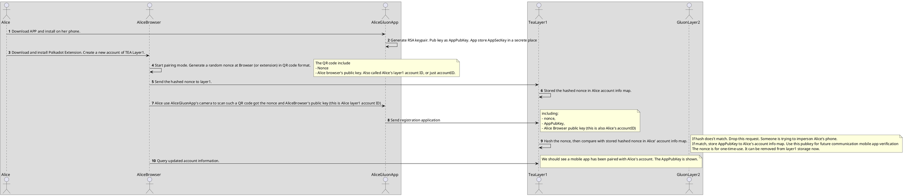
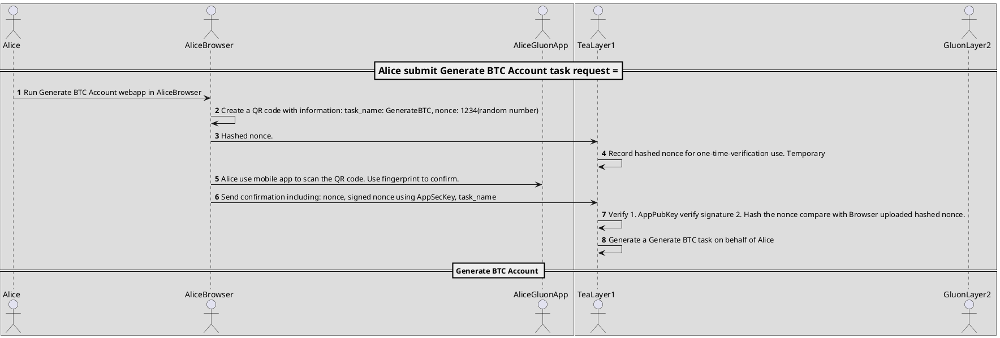
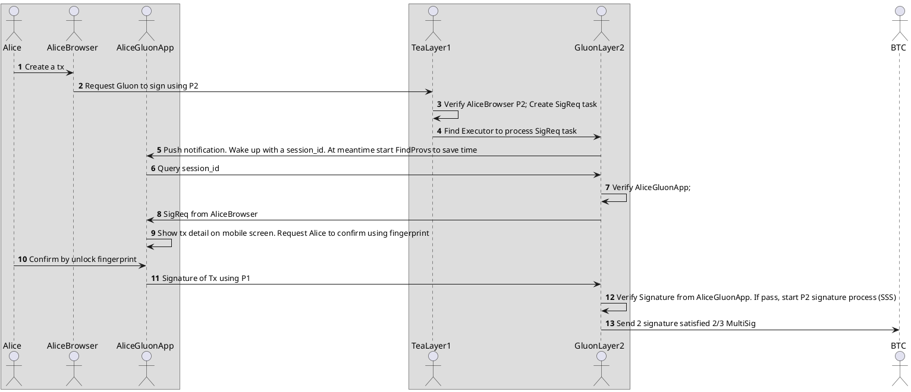
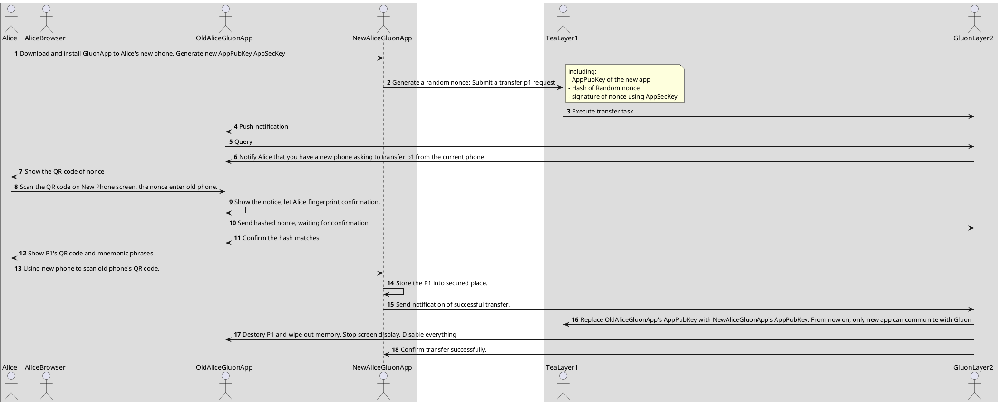

# Overall

Let's assume Alice is our client. She is going to create a BTC wallet that managed by Gluon.
In order to get disaster recovery, she assign her three friends Bob, Charlie and Dave to be her recovery accounts.

Alice needs to have a TEA Layer1 plugin (Polkadot extension) on her browser. She also needs to install Gluon mobile app on her phone.

Gluon will create a 2/3 Multisig BTC account. The 3 keypairs are called P1, P2 and P3.

P1 is sent to Alice's mobile phone immediately. Gluno won't have any copy of P1 secret key

P2 is managed by Gluon under Alice's control.

P3 is managed by Cluon under Friend Recovery Smart Contract Control (FRSC). 

Because this BTC account is 2/3 Multisig. Any 2 of P1 P2 P3 can pass authentication.
## Alice register Gluon wallet account

Only one mobile app can be paired with Alice's account at any time. If Alice want to update her phone, she need to run the Transfer task to assign new phone and disable old phone.

Once Alice' mobile app is paired with Alice' account. Only Alice's mobile app can send message to both Gluon layer1 and layer2. Everytime Gluon will use a nonce to verify AppPubKey signature to prevent man in the middle attack.
## Generate BTC 2/3 MultiSig Account

## In common usage cases

In common usage, only P1 and P2 are used to sign a transaction.

Typically Alice can start a transaction from a web browser. Once a transaction is created (for example, sending $100 to Eve).  

Alice use her browser's Polakdot Extension to sign a signature request (SigReq) of this transaction. Note: This is a Signature Request sending to Gluon, not a signature of this transaction. Gluon receives this SigReq, save it in Task Pool but not continue until P1 (Mobile app) to sign first. After few seconds, her mobile Gluon app receive a push notification. Alice use her fingerprint (or Face recognization depends on her phone settings) to unlock the Gluon app. Gluon app will show the detail of transaction, in our case "Sending $100 to Eve). Alice re-confirm the transaction then click sign. Alice's mobile phone has P1 secret so that the app can sign this transaction. P1 is completed. This P1 signature also send to Gluon. Gluon received P1 Signature and verify. If this signature from a registered phone all and verify successfully, Gluon will conintue to get P2 signature using Sharmir Secret Sharing Schema. Once P2 is signed, both signature send to BTC.

## Transfer the P1 to a new phone

We do not recommended our client to backup mnemonic passphrase. If client cannot manage the mnemonic correctly, it may cause secret leaking. Although if Alice leak P1 only may not cause any asset loss, it increase the risk since there is only P2 or P3 to protect her assets. However, we allow client to upgrade there phone so that the secret can be transferred from old phone to new phone at a much lower risk. That means a one-time display mnemonic. 

In order to discourage Alice display and backup her mnemonic, we would force Alice to install Gluon app on her new phone before she can display mnemonic on her old phone. When new phone registered successful, Gluon will allow old app show the mneonic in text or QR code once. At this same time, revoke old app's registration. Any new transaction sent from old app won't be accepted. 

Alice can use her new phone's Gluon app to scan the QR code immediately. New Gluon app will recover the P1 secret. Once done, sending successful signal to Gluon. Gluon will request old Gluon app to destroy secret also disable its access forever. Any information sending from the old app won't be accepted from now on.

Alice needs to be very careful when transfer P1 from old phone to new phone. She needs to make sure no one can see the QR code or mnemoonic during the transfer. 

## If Alice lost both her phone and computer (p1 and p2)

The FRSC (Friend Recovery Smart Contract) controlled P3 is only used when Alice lost her phone AND her layer1 account secret key. Alice is lucky, this is just because she lost the key, not leaking. No one have both her P1 and P2 yet. If someone have her P1 and P2, he can take over Alice's assets.

This is a very rare case and if this happened in other blockchain projects, this could mean that Alice will lose her assets forever. But we can still use Friend recovery to get the P2 back to her new generated layer1 account, so that her assets are saved.

# Replica and Shamir Secret Sharing

